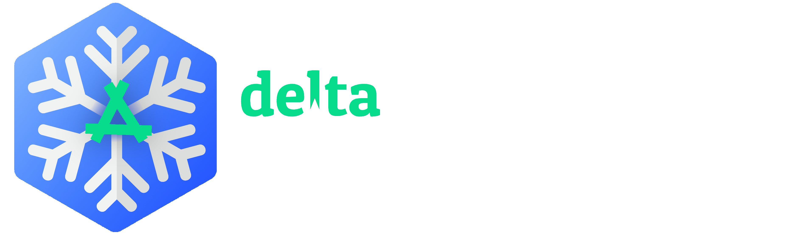

### About DWoC

DWoC is a winter-long program organised by [Delta Force](https://delta.nitt.edu/), the coding club of NIT Trichy. With an aim to support and improve the culture of open-source software around us, this serves as a platform for young student developers (or even starters) to hone their technical skills by working on projects of their interests. We hope this encourages collaborative experiences and allows students from all backgrounds to contribute to quality technical projects from diverse fields. 
For more information, visit [DWoC](https://dwoc.io/)